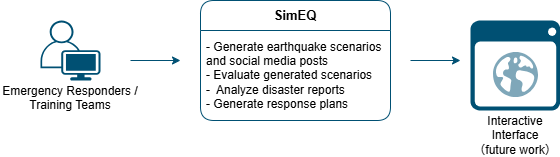

# SimEQ: Using GenAI to Simulate Earthquakes and Enhance Disaster Response
- Inspiration: This is built as a capstone project for [5-Day Gen AI Intensive Course with Google Learn Guide](https://www.kaggle.com/learn-guide/5-day-genai), see [Gen AI Intensive Course Capstone 2025Q1](https://www.kaggle.com/competitions/gen-ai-intensive-course-capstone-2025q1/overview#gen-ai-capabilities) for criteria. 

--- 

### The Problem: When Seconds Matter, So Does Information

During an earthquake, every second counts. Emergency response teams face rapidly evolving, complex situations. Critical data comes from many sources, like social media and disaster reports, but often remains unstructured and overwhelming. Traditional planning relies on slow, manual analysis and specific expertise, even fully trained, but is stressful and overwhelming for the process of making decisions.

**SimEQ** tackles this problem by simulating earthquake scenarios and generating actionable response plans. It analyzes documents, interprets social media posts, and summarizes key priorities like most affected areas, resources needed and urgency. This helps emergency planners respond faster and more effectively, and training teams for education and training purpose.

---

### How GenAI Helps: From Chaos to Clarity



SimEQ leverages GenAI for:
- Document Understanding: Analyze disaster reports to simulate realistic earthquake scenarios
    ```python
    model_config = types.GenerateContentConfig(temperature=0.1, top_p=0.95)

    response = client.models.generate_content(
        model='gemini-2.0-flash',
        config=model_config,
        contents=[request, document_sim_file])
    ```
- GenAI Evaluation: Evaluate and rate the responses model generated to pick a better model config/settings
    ```python
        chat = client.chats.create(model='gemini-2.0-flash')

        response = chat.send_message(
            message=SIMU_PROMPT.format(prompt=prompt, response=ai_response)
        )
        verbose_eval = response.text
    ```
- Few-shot Prompting: Simulating realistic social media posts
    ```python
    tweet_examples = [
    "I'm stuck near downtown! Buildings collapsed!",
    "No power or water since 2am!",
    "Can someone send help to East Valley shelter?",
    ]

    user_prompt = f'''
    Generate 5 realistic tweets from residents in {location} during a {magnitude} magnitude earthquake at {time}. 
    The area has {population_density} population density. Tweets should reflect panic, help requests, and status updates.
    Include relevant hashtags like #earthquake and #{location}.
    Tweets:
    '''
    ```
- Retrieval-Augmented Generation (RAG): Match queries with reference docs
    ```python
    def ask_rag(query):
        top_docs = retrieve_relevant_chunks(query)
        context = "\n\n".join(top_docs)

        rag_prompt = f"""
        You are a disaster response analyst. Use the following retrieved document excerpts to answer the query:
        --- DOCUMENT CONTEXT START ---
        {context}
        --- DOCUMENT CONTEXT END ---
        Answer this query in a clear and concise way: {query}
        """
        rag_response = client.models.generate_content(
            model='gemini-2.0-flash',
            contents=[rag_prompt])
        return Markdown(rag_response.text)
    ```
- Embeddings + Vector DB: Efficient information retrieval
    ```python
    def embed(text):
        emb_response = client.models.embed_content(
            model='models/text-embedding-004',
            contents=text, 
            config=types.EmbedContentConfig(task_type='RETRIEVAL_DOCUMENT'))
        time.sleep(1)  # Add a delay to avoid exceeding the rate limit
        return emb_response.embeddings[0].values 
    
    import chromadb
    DB_NAME = "earthquake_docs"

    chroma_client = chromadb.Client()
    db = chroma_client.get_or_create_collection(name=DB_NAME) 

    # Load and chunk PDF
    doc_chunks = chunk_text(combined_text)
    print(f"Generated {len(doc_chunks)} chunks.")

    # Convert text chunks to embeddings and store
    for i, chunk in enumerate(doc_chunks):
        emb = embed(chunk)
        db.add(documents=[chunk], embeddings=[emb], ids=[f"chunk_{i}"])

    print(f"Stored {len(doc_chunks)} chunks in Chroma vector DB. ")
    ```
- Structured Output: Output formatted plans for quick decision-making
    ```python
    resp_prompt = f"""
    You are a disaster response expert.
    Using the retrieved Disaster overview, SitRep and Response Plan 
    and Earthquake response guideline context below, answer the query in a 
    structured and clear format. Then output a structured JSON summary.

    ### Context:
    {context}

    ### User Query:
    {user_query}

    ### Instructions:
    1. Address:
      - Affected areas
      - Rescue & response priorities
      - Coordination roles
      - Resource needs
      - Gaps & recommendations

    2. Then give a summary in the following JSON format:
    {{
      "areas_affected": [],
      "injuries": [],
      "priority_actions": [],
      "resources_needed": [],
      "coordination_roles": [],
      "gaps": []
    }}

    ### Response:
    """
    ```

---

### Current Limitations

While SimEQ offers promising GenAI integrations, there are some limitations:
- GenAI response quality varies—prompt tuning is needed
- Only supports up to 3 documents for now
- Scenario generation lacks realism due to limited datasets
- Embedding large docs is slow and resource-heavy

---

### What’s Next: The Future of SimEQ
- Build an MLOps CI/CD pipeline for faster deployment, testing and evaluation
- Integrate realistic datasets like CEED and Texas Earthquake AI sets
- Explore agents and fine-tuned models for better planning and response
- Design an interactive UI for users to input roles, upload documents, and view dynamic plans
- Expand to support floods, wildfires, and more

**Art of the Possible?**  
A fully automated, real-time disaster response assistant integrated with live sensors, satellite feeds, social media posts and disaster reports. 

---

### Wrap-Up

SimEQ is just the beginning. In critical moments, clarity saves lives. By combining GenAI with disaster planning, we can transform chaos into clear, actionable insight.


